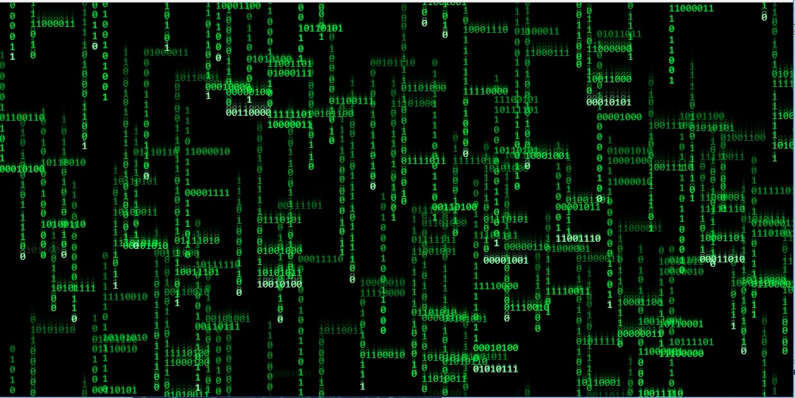

# Modified Matrix Digital Rain: Binary Rain

A modified version of the Digital Rain sequence from the Matrix showing binary streams rainning and bytes accessing each value. The code is a different version of emilyxxie/green_rain demonstrated on [Coding Train](https://www.youtube.com/watch?v=S1TQCi9axzg) YouTube channel.

This animation is going to be on http://volfeganbox.byethost14.com/